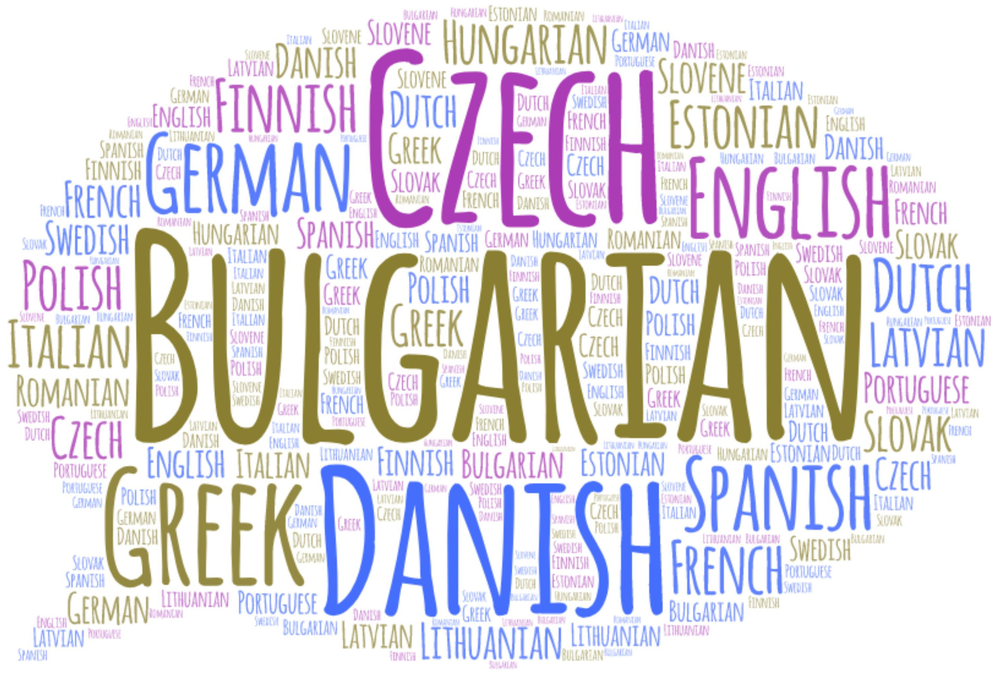

# Natural Language Processing Projects

---

**In this repository you will find different projects of classic NLP tasks:**
- Text classification/Document Classification
- Fake News Detection Identification
- Sentiment Analysis
- Text Generation

---

## A Simple Language Detection

**Objective:** The goal here is to create a language detector model based on "The Europarl parallel" corpus using classical techniques of Natural Language Processing and Machine Learning. 
I will then use this model to detect the language of new sentences taken from Wikipedia. 
This language detection task falls basically into Text Classification. 

<a href="https://domsdev.github.io/Data-science-blog/post/a_simple_language_detector/">Blog post: A simple Language Detector</a>

